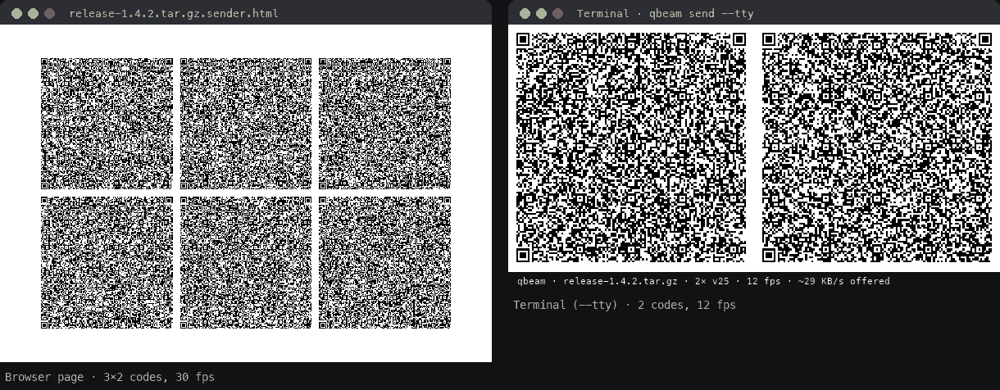
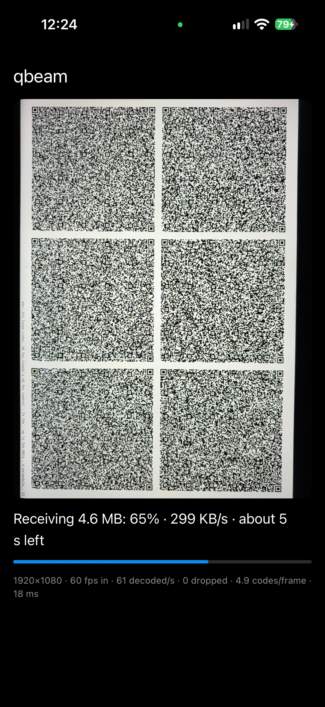
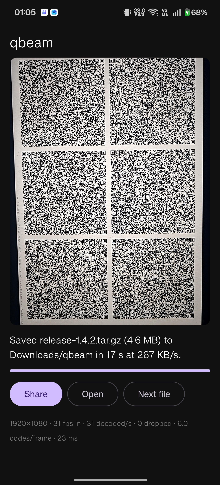

# qbeam — files over light

Send a file from a computer screen to your phone as a stream of QR codes. No network between the two, no cable, no
admin rights, nothing to install on the computer beyond one command. Every transfer is checked with SHA-256.

[](https://pypi.org/project/qbeam/)
[](https://www.npmjs.com/package/qbeam)
[](https://github.com/qbeam/qbeam/releases/latest)
[](https://github.com/qbeam/qbeam/actions/workflows/ci.yml)
[](LICENSE)



```bash
uvx qbeam send report.pdf
```

Then point your phone at the codes, with [qbeam.dev/r](https://qbeam.dev/r) open or the [Android app](#receive). The
file arrives once it's complete and verified.

> Early alpha: expect rough edges, and please report them as issues.

## Install

Every option works without admin rights, on macOS, Linux and Windows.

| You have | Run |
| --- | --- |
| [uv](https://docs.astral.sh/uv/) | `uvx qbeam send <file>` (nothing to install) |
| pipx | `pipx install qbeam`, then `qbeam send <file>` |
| Node 18+ | `npx qbeam send <file>` |
| Only Python 3.8+ | download `qbeam-<version>.pyz` from the [latest release](https://github.com/qbeam/qbeam/releases/latest), then `python3 qbeam-<version>.pyz send <file>` |

The Python package uses only the standard library. Encryption needs one extra there:
`pipx install "qbeam[crypto]"` (the npm version has it built in).

## Send

| Command | What it does |
| --- | --- |
| `qbeam send <file>` | Opens the sender page in your browser. Press Fullscreen. Fastest |
| `qbeam send --tty <file>` | Draws the codes in the terminal instead: over SSH, or with no browser. Automatic over SSH |
| `--speed safe` / `fast` / `max` | 2×2 codes at 10 fps / 3×2 at 15 fps (default) / 3×2 larger codes at 30 fps for a 60 fps phone camera |
| `qbeam send ./project` | A folder, as one archive (respects `.gitignore`; Python version) |
| `cat build.log \| qbeam send -` | Standard input |
| `--encrypt` | AES-256-GCM. Prints a passphrase to type on the phone; keep it off the screen the camera sees |

For terminal mode, make the window large and the font small: more codes fit, so it goes faster.

## Receive

| On | Use |
| --- | --- |
| **Android** | The app: [download the APK](https://github.com/qbeam/qbeam/releases/latest) (Android 10+). Native decoding, saves to Downloads/qbeam, no internet permission. Also coming to IzzyOnDroid and F-Droid |
| **iPhone**, or any phone | [qbeam.dev/r](https://qbeam.dev/r) in Safari or Chrome. Add it to the home screen and it works offline. An iPhone app is in testing |
| A laptop's webcam | `qbeam receive` opens the same receiver page locally |

<p>
  
  &nbsp;
  
</p>

Measured with `--speed max`: about **280 KB/s** in the apps (iPhone 15, OnePlus 12) and 246 KB/s in Chrome on the
iPhone. A 2 MB photo takes about 8 seconds; text and logs are compressed first, so they go faster.

<details>
<summary>Verifying the Android APK</summary>

Check the download against the `.sha256` file next to it. The app's signing certificate (SHA-256) is:

```
C9:FC:71:E0:52:E3:2A:50:B3:79:74:C7:03:67:9F:5C:FE:68:A3:6E:DA:37:E3:EA:C8:99:D9:34:0B:50:72:14
```

`apksigner verify --print-certs qbeam-<version>.apk` shows it. Updates must be signed with the same certificate.
</details>

## How it works

- The file is compressed, split into blocks and encoded with a **fountain code**: the phone can rebuild it from any
  large enough set of codes, so a missed frame never means waiting for the loop to come round.
- Each frame shows a grid of QR codes in binary mode. The receiver reads several per camera frame with
  [zxing-cpp](https://github.com/zxing-cpp/zxing-cpp) (natively in the apps, as WebAssembly in the browser).
- The format is specified in [protocol/SPEC.md](protocol/SPEC.md), with shared test vectors that every implementation
  (Python, JavaScript, Kotlin, Swift) must pass.

## Privacy and acceptable use

No accounts, analytics or telemetry, and the CLI makes no network connections: see the
[privacy page](https://qbeam.dev/privacy/). Anyone who can see the sending screen can read an unencrypted transfer.
Use `--encrypt` for anything sensitive, and only move data you're authorised to move, on systems you're allowed to
use it on.

<details>
<summary>Contributing: repository layout and tests</summary>

| Path | What |
| --- | --- |
| `protocol/` | Wire-format spec and shared test vectors |
| `py/` | Python package `qbeam` on PyPI (stdlib only) |
| `js/` | Protocol v3 reference codec (`qbeam3.js`) and npm package `qbeam` |
| `web/` | Sender and receiver pages; `web/build.py` builds `web/dist/decoder.html` |
| `android/`, `ios/` | Native receiver apps (Kotlin + CameraX, Swift + AVFoundation; both use zxing-cpp) |
| `site/` | qbeam.dev |
| `store/` | Store listings and screenshots |
| `docs/` | Releasing, README media (`scripts/readme_media.py` builds the GIF) |

Tests (from the repo root): `python3 -m unittest discover -s py/tests` and `node js/test/roundtrip.js`,
`v3.js`, `terminal_decode.js`, `fuzz.js`, `optics.js`. Android: `./gradlew :core:test` in `android/`.
iOS codec: `swift test` in `ios/QBeamKit`. Releases: [docs/RELEASING.md](docs/RELEASING.md).
</details>

## Support qbeam

qbeam is free and open source. If it saves you time, you can help keep it going:

[](https://github.com/sponsors/MLTurtle)
[](https://ko-fi.com/MLTurtle)

## License

Apache-2.0: see [LICENSE](LICENSE). Third-party components: [THIRD_PARTY_NOTICES.md](THIRD_PARTY_NOTICES.md).
